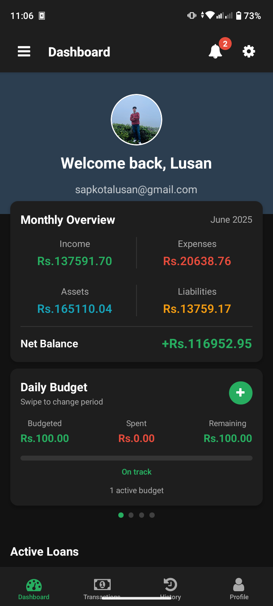

# 🧾 CaptainLedger — Your Finance, Your Rules

> **A privacy-first personal finance manager that respects your data and your freedom.**

  
   
  <i>📱 Demo Screenshot — Phone UI Preview</i>

---

## ✨ What Makes CaptainLedger Special?

CaptainLedger isn’t just another expense tracker—it’s **designed from the ground up with privacy in mind**.
No ads. No analytics. No corporate tracking. Just a clean, offline-first finance manager you can **trust**.

### 🔐 Key Features

* **🔒 Privacy-First** — Your data stays on *your* device by default
* **📱 Cross-Platform** — Works on Web, Android, and iOS via PWA or native install
* **💸 Smart Finance Tools** — Manage expenses, budgets, investments, loans
* **🌍 Multi-Currency** — Real-time FX rates with offline fallback
* **📊 Clean Analytics** — Insights into your spending habits with beautiful graphs
* **🔄 Optional Self-Hosting** — Sync with your own server when you choose to

---

## 🚧 Project Status & Roadmap

> 🟡 **Ongoing Development** — Stable core, polishing server sync and offline-first logic

| Feature                           | Status         |
| --------------------------------- | -------------- |
| Core Expense Tracking             | ✅ Complete     |
| Budgeting & Visual Analytics      | ✅ Complete     |
| Server Sync with Flask Backend    | ✅ 95% done     |
| JWT + Device Trust Authentication | ✅ Ready        |
| Offline-First Mode (No Server)    | 🔄 In Progress |
| Demo Video                        | 🎬 Coming Soon |

> ⚙️ **Backend is production-ready** for users who want to self-host and sync across devices. The **next major step** is finalizing the **offline-first** experience—**built on the same backend logic** but fully functional without an internet connection.

---

## 🧪 Tech Stack Overview

| Layer     | Tech                                  |
| --------- | ------------------------------------- |
| Frontend  | **React Native** + Expo Router        |
| Backend   | **Flask (Python)** REST API           |
| Local DB  | **SQLite** (Offline-first)            |
| Remote DB | **PostgreSQL** (Optional sync server) |
| Security  | **JWT Auth** + Device Trust System    |

---

## 📄 License

**AGPL-3.0 License** — ensuring CaptainLedger remains **free, open-source, and user-respecting forever**.

---

## 👨‍💻 Built With Love

Made with ❤️ by an independent developer who believes **financial privacy** should be a **right**, not a luxury.

